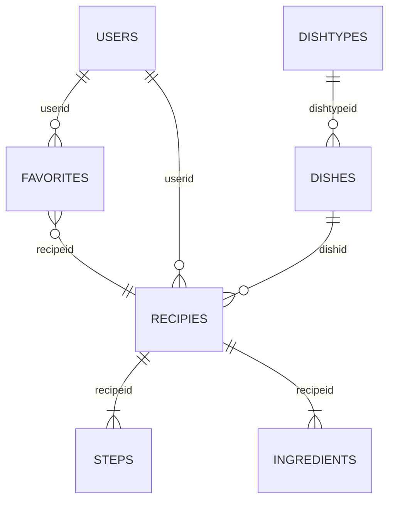
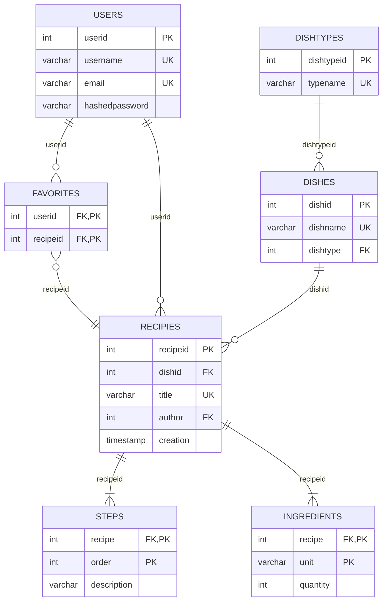

## Recipe website

### Logical data model

### Conceptual data model

1. All columns of integer data type that are marked as non-composite primary keys should be auto-incremented.
2. All columns should be marked as NOT NULL, except for:
    - Quantity column in the Ingredients table (to represent ingredients of undefined quantity)

