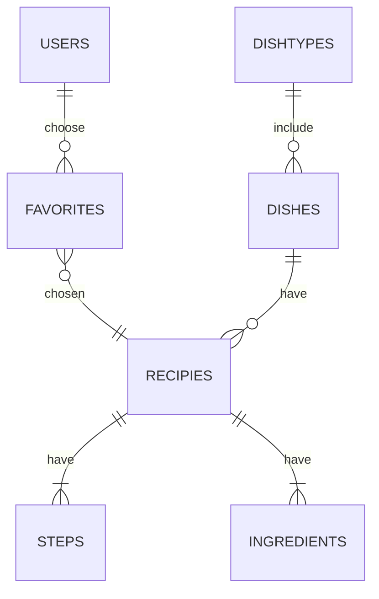

# Task 1: Database modeling

## Recipe website

### Logical data model

```mermaid
erDiagram
    USERS ||--o{ FAVORITES : choose
    FAVORITES }o--|| RECIPIES : chosen

    DISHTYPES ||--o{ DISHES : include
    DISHES ||--o{ RECIPIES : have
    RECIPIES ||--|{ STEPS : have
    RECIPIES ||--|{ INGREDIENTS : have
```
